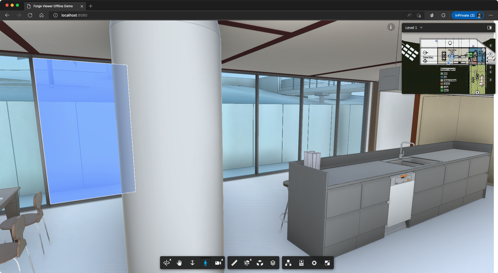

# Forge Viewer offline mode demo


[](http://opensource.org/licenses/MIT)

# Description

This sample demonstrates how to make minimap and levels extension work with Forge Viewer offline mode following this blog https://forge.autodesk.com/blog/consume-aec-data-svfs-your-own-server

## Thumbnail



### Run locally

Install [NodeJS](https://nodejs.org), and type the following command in the terminal console

```bash
npm start # or npx http-server
```

It will use [http-server](https://github.com/http-party/http-server) to host a temporary web server on the root folder of this project, and then open http://localhost:8080 in your web browser.

# License

This sample is licensed under the terms of the [MIT License](http://opensource.org/licenses/MIT).
Please see the [LICENSE](LICENSE) file for full details.

## Written by

Eason Kang [@yiskang](https://twitter.com/yiskang), [Developer Advocacy and Support](http://aps.autodesk.com)
